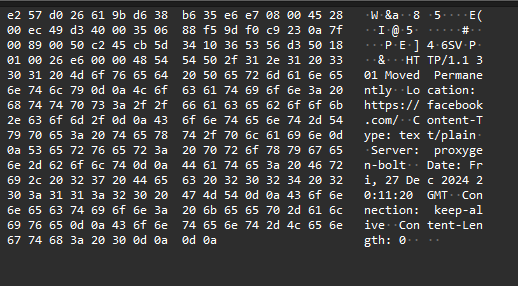
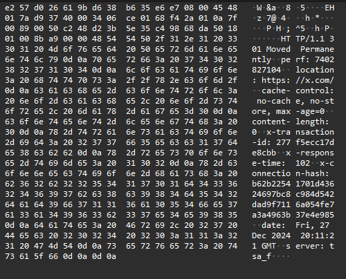
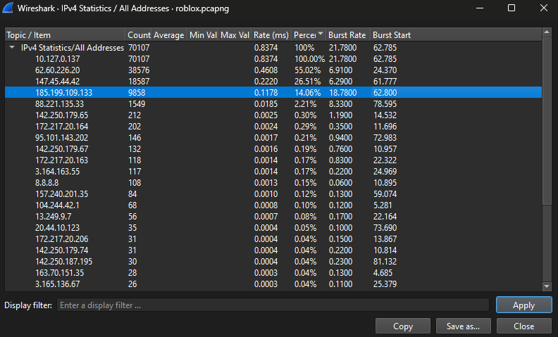
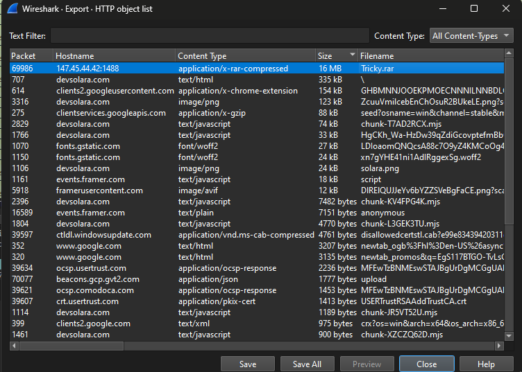
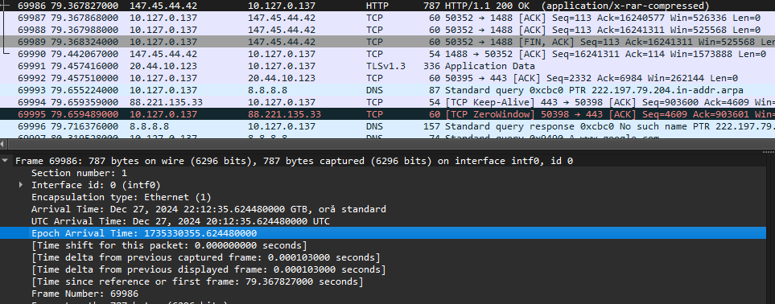
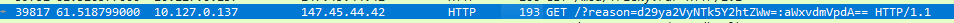
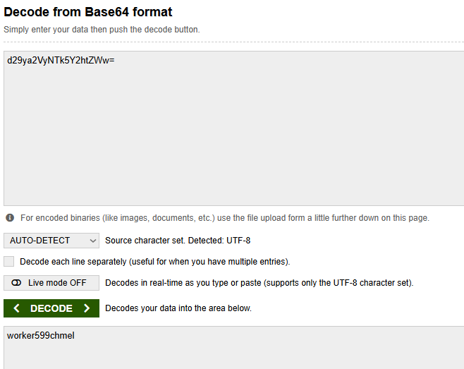
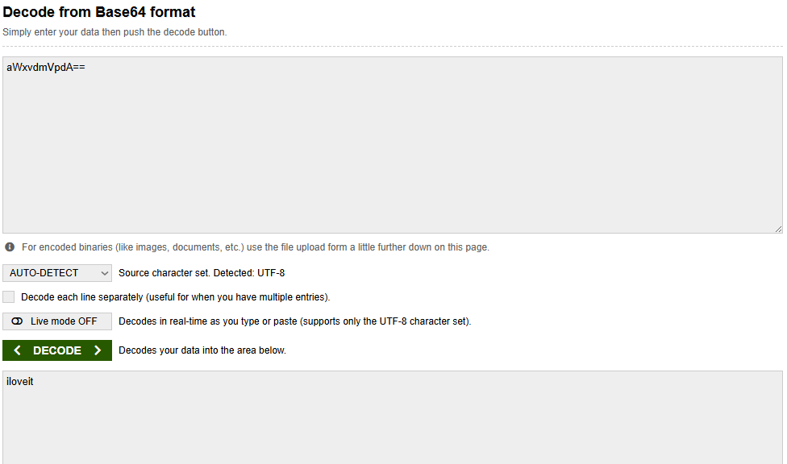
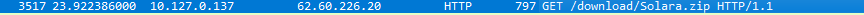

# Starting off

## Sunt accesate 2 platforme de social media de către malware. Care sunt acestea?
Putem face un *educated guess* și să presupunem că platformele de social media folosesc protocolul HTTP.  
Dacă aplicăm filtrul HTTP în Wireshark, putem observa:  
  
și  
  
**Answer: OSC{facebook.com,x.com}**  

## Care este adresa IP a C2-ului?
Fiind un server C2, putem presupune că va avea un volum ridicat de request-uri.  
Uitându-ne în statistici, putem analiza IP-urile cu cele mai multe request-uri:  
  
**Answer: OSC{147.45.44.42}**  

## Identificați numărul pachetului care conține transferul fișierului/payload-ului adițional descărcat de malware.
Uitându-ne la File → Export Objects → HTTP, putem observa un fișier suspect, „Tricky.rar”:  
  
De aici putem vedea că numărul pachetului este 69986.  
**Answer: OSC{69986}**  

## Care este arrival time în pachetul care conține fișierul .rar?
Mergem la pachetul cu numărul specificat anterior și observăm epoch arrival time.  
  
**Answer: OSC{1735330355.624480000}**  

## Ce „motiv” primește C2-ul astfel încât să autorizeze descărcarea malware-ului pe computerul infectat?
Continuând analiza request-urilor HTTP, putem observa unul care conține „?reason=...”:  
  

Request-ul complet este:  
/?reason=d29ya2VyNTk5Y2htZWw=:aWxvdmVpdA==  

Putem observa că aceste valori sunt codate în Base64.  
După decodare:  
  
și  
  

**Answer: OSC{worker599chmel:iloveit}**  

## Care este numele cheat-ului folosit pentru Roblox?
În request-ul 3517 putem observa arhiva „Solara.zip”:  
  

Solara este un cheat popular pentru Roblox.  
**Answer: OSC{solara}**
