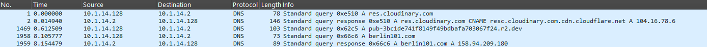
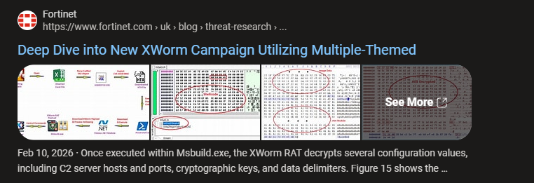

## Care este numele malware-ului care a fost rulat aici?

### Analiza PCAP

Cand ne uitam in fisierul PCAP observam foarte rapid ca aproape tot traficul este criptat si nu poate fi analizat direct.  
Singurele lucruri lizibile sunt request-urile DNS.  

  

Uitandu-ne aici putem observa un domeniu suspicious numit "berlin101".  

Daca cautam berlin101.com pe Google, primul rezultat arata ca acest domeniu a fost implicat in campanii malware asociate cu XWorm.    

Articol relevant:  
https://www.fortinet.com/uk/blog/threat-research/deep-dive-into-new-xworm-campaign-utilizing-multiple-themed-phishing-emails  

Din aceasta corelatie putem deduce malware-ul folosit, dar si alte informatii utile pentru intrebarile urmatoare.

## Raspunsuri finale

Care este numele malware-ului care a fost rulat aici?  
OSC{xworm}  

In ce este scris malware-ul?  
OSC{.NET}  

Care este numele serverului de Command and Control (C2)?  
OSC{berlin101.com}  

Ce tip de malware a fost acesta?  
OSC{worm}  
