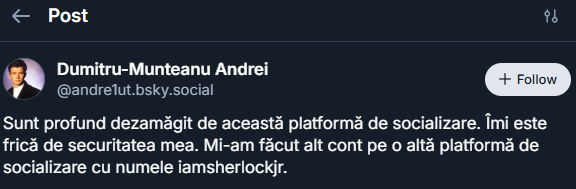
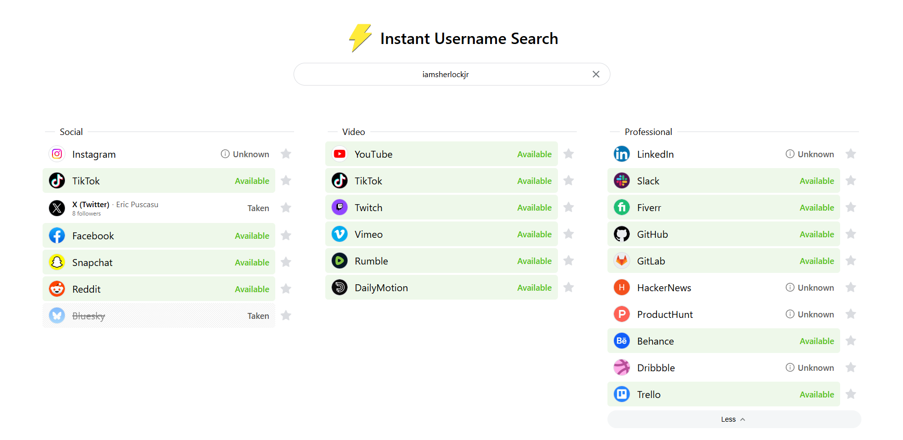
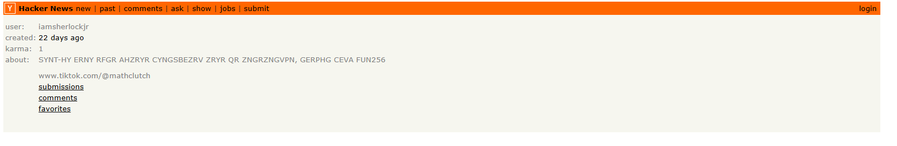

# Detectivul andre1ut

Detectivul **andre1ut** vrea să o ia pe urmele lui Sherlock Holmes. Acesta și-a făcut un cont cu numele de utilizator `andre1ut` pe platforma de socializare a Cerului Albastru și vrea să îți transmită un mesaj secret.

Trebuie să folosim indiciile primite în cerință pentru a ajunge la răspunsul final.

## Identificarea platformei

„Platforma de socializare a Cerului Albastru” se referă destul de clar la platforma **Bluesky**.

Căutând username-ul `andre1ut` pe Bluesky, găsim următorul profil:  

  

De aici observăm un nou username interesant: `iamsherlockjr`.

## Căutarea username-ului pe alte platforme

Pentru a vedea dacă acest username este folosit și pe alte platforme, putem folosi site-ul:

https://instantusername.com/

Căutând `iamsherlockjr`, observăm un rezultat interesant pe **Hacker News**:  

  

Dacă vizităm profilul de pe Hacker News, putem vedea următoarea pagină:  

  

## Mesajul ascuns

În secțiunea **about me**, găsim următorul string:

> SYNT-HY ERNY RFGR AHZRYR CYNGSBEZRV ZRYR QR ZNGRZNGVPN, GERPHG CEVA FUN256

La prima vedere, textul pare să fie format din cuvinte, dar nu are sens în forma actuală. Deoarece literele par doar înlocuite, încercăm un filtru simplu de tip **ROT13**.

După aplicarea ROT13, obținem:

> FLAG-UL REAL ESTE NUMELE PLATFORMEI MELE DE MATEMATICA, TRECUT PRIN SHA256

Mesajul ne spune că flag-ul real este numele platformei de matematică, trecut prin SHA256.

## Identificarea platformei de matematică

Tot în secțiunea **about me**, observăm și un cont de TikTok. Intrând pe acel link, aflăm că platforma se numește:

> MathClutch

Așadar, trebuie să calculăm hash-ul SHA256 pentru `MathClutch`.

Hash-ul rezultat este:

> 37b98a8ea0f2adfea9eb1e9cc3bcce4c8f58187191f40ae1f77916b59e343099

## Răspuns final

**answer: CTF{37b98a8ea0f2adfea9eb1e9cc3bcce4c8f58187191f40ae1f77916b59e343099}**
